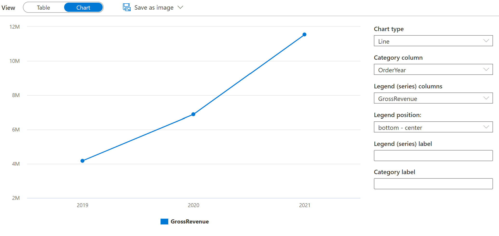
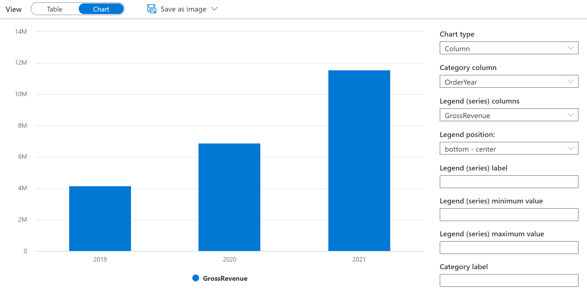

---
lab:
    title: 'Query files using a serverless SQL pool'
    ilt-use: 'Lab'
---

# Query files using a serverless SQL pool

SQL is probably the most used language for working with data in the world. Most data analysts are proficient in using SQL queries to retrieve, filter, and aggregate data - most commonly in relational databases. As organizations increasingly take advantage of scalable file storage to create data lakes, SQL is often still the preferred choice for querying the data. Azure Synapse Analytics provides serverless SQL pools that enable you to decouple the SQL query engine from the data storage and run queries against data files in common file formats such as delimited text and Parquet.

This lab will take approximately **40** minutes to complete.

## Before you start

You'll need an [Azure subscription](https://azure.microsoft.com/free) in which you have administrative-level access.

## Provision an Azure Synapse Analytics workspace

You'll need an Azure Synapse Analytics workspace with access to data lake storage. You can use the built-in serverless SQL pool to query files in the data lake.

In this exercise, you'll use a combination of a PowerShell script and an ARM template to provision an Azure Synapse Analytics workspace.

1. Sign into the [Azure portal](https://portal.azure.com) at `https://portal.azure.com`.
2. Use the **[\>_]** button to the right of the search bar at the top of the page to create a new Cloud Shell in the Azure portal, selecting a ***PowerShell*** environment and creating storage if prompted. The cloud shell provides a command line interface in a pane at the bottom of the Azure portal, as shown here:

    

    > **Note**: If you have previously created a cloud shell that uses a *Bash* environment, use the the drop-down menu at the top left of the cloud shell pane to change it to ***PowerShell***.

3. Note that you can resize the cloud shell by dragging the separator bar at the top of the pane, or by using the **&#8212;**, **&#9723;**, and **X** icons at the top right of the pane to minimize, maximize, and close the pane. For more information about using the Azure Cloud Shell, see the [Azure Cloud Shell documentation](https://docs.microsoft.com/azure/cloud-shell/overview).

4. In the PowerShell pane, manually enter the following commands to clone this repo:

    ```
    rm -r dp203 -f
    git clone https://github.com/MicrosoftLearning/dp-203-azure-data-engineer dp203
    ```

5. After the repo has been cloned, enter the following commands to change to the folder for this lab and run the **setup.ps1** script it contains:

    ```
    cd dp203/Allfiles/labs/02
    ./setup.ps1
    ```

6. If prompted, choose which subscription you want to use (this will only happen if you have access to multiple Azure subscriptions).
7. When prompted, enter a suitable password to be set for your Azure Synapse SQL pool.

    > **Note**: Be sure to remember this password!

8. Wait for the script to complete - this typically takes around 10 minutes, but in some cases may take longer. While you are waiting, review the [Serverless SQL pool in Azure Synapse Analytics](https://docs.microsoft.com/azure/synapse-analytics/sql/on-demand-workspace-overview) article in the Azure Synapse Analytics documentation.

## Query data in files

The script provisions an Azure Synapse Analytics workspace and an Azure Storage account to host the data lake, then uploads some data files to the data lake.

### View files in the data lake

1. After the script has completed, in the Azure portal, go to the **dp203-*xxxxxxx*** resource group that it created, and select your Synapse workspace.
2. In the **Overview** page for your Synapse workspace, in the **Open Synapse Studio** card, select **Open** to open Synapse Studio in a new browser tab; signing in if prompted.
3. On the left side of Synapse Studio, use the **&rsaquo;&rsaquo;** icon to expand the menu - this reveals the different pages within Synapse Studio that you'll use to manage resources and perform data analytics tasks.
4. On the **Data** page, view the **Linked** tab and verify that your workspace includes a link to your Azure Data Lake Storage Gen2 storage account, which should have a name similar to **synapse*xxxxxxx* (Primary - datalake*xxxxxxx*)**.
5. Expand your storage account and verify that it contains a file system container named **files**.
6. Select the **files** container, and note that it contains a folder named **sales**. This folder contains the data files you are going to query.
7. Open the **sales** folder and the **csv** folder it contains, and observe that this folder contains .csv files for three years of sales data.
8. Right-click any of the files and select **Preview** to see the data it contains. Note that the files do not contain a header row, so you can unselect the option to display column headers.
9. Close the preview, and then use the **&#8593;** button to navigate back to the **sales** folder.
10. In the **sales** folder, open the **json** folder and observe that it contains some sample sales orders in .json files. Preview any of these files to see the JSON format used for a sales order.
11. Close the preview, and then use the **&#8593;** button to navigate back to the **sales** folder.
12. In the **sales** folder, open the **parquet** folder and observe that it contains a subfolder for each year (2019-2021), in each of which a file named **orders.snappy.parquet** contains the order data for that year. 
13. Return to the **sales** folder so you can see the **csv**, **json**, and **parquet** folders.

### Use SQL to query CSV files

1. Select the **csv** folder, and then in the **New SQL script** list on the toolbar, select **Select TOP 100 rows**.
2. In the **File type** list, select **Text format**, and then apply the settings to open a new SQL script that queries the data in the folder.
3. In the **Properties** pane for **SQL Script 1** that is created, change the name to **Sales CSV query**, and change the result settings to show **All rows**. Then in the toolbar, select **Publish** to save the script and use the **Properties** button (which looks similar to **&#128463;.**) on the right end of the toolbar to hide the **Properties** pane.
4. Review the SQL code that has been generated, which should be similar to this:

    ```SQL
    -- This is auto-generated code
    SELECT
        TOP 100 *
    FROM
        OPENROWSET(
            BULK 'https://datalakexxxxxxx.dfs.core.windows.net/files/sales/csv/',
            FORMAT = 'CSV',
            PARSER_VERSION='2.0'
        ) AS [result]
    ```

    This code uses the OPENROWSET to read data from the CSV files in the sales folder and retrieves the first 100 rows of data.

5. In the **Connect to** list, ensure **Built-in** is selected - this represents the built-in SQL Pool that was created with your workspace.
6. On the toolbar, use the **&#9655; Run** button to run the SQL code, and review the results, which should look similar to this:

    | C1 | C2 | C3 | C4 | C5 | C6 | C7 | C8 | C9 |
    | -- | -- | -- | -- | -- | -- | -- | -- | -- |
    | SO45347 | 1 | 2020-01-01 | Clarence Raji | clarence35@adventure-works.com |Road-650 Black, 52 | 1 | 699.0982 | 55.9279 |
    | ... | ... | ... | ... | ... | ... | ... | ... | ... |

7. Note the results consist of columns named C1, C2, and so on. In this example, the CSV files do not include the column headers. While it's possible to work with the data using the generic column names that have been assigned, or by ordinal position, it will be easier to understand the data if you define a tabular schema. To accomplish this, add a WITH clause to the OPENROWSET function as shown here (replacing *datalakexxxxxxx* with the name of your data lake storage account), and then rerun the query:

    ```SQL
    SELECT
        TOP 100 *
    FROM
        OPENROWSET(
            BULK 'https://datalakexxxxxxx.dfs.core.windows.net/files/sales/csv/',
            FORMAT = 'CSV',
            PARSER_VERSION='2.0'
        )
        WITH (
            SalesOrderNumber VARCHAR(10) COLLATE Latin1_General_100_BIN2_UTF8,
            SalesOrderLineNumber INT,
            OrderDate DATE,
            CustomerName VARCHAR(25) COLLATE Latin1_General_100_BIN2_UTF8,
            EmailAddress VARCHAR(50) COLLATE Latin1_General_100_BIN2_UTF8,
            Item VARCHAR(30) COLLATE Latin1_General_100_BIN2_UTF8,
            Quantity INT,
            UnitPrice DECIMAL(18,2),
            TaxAmount DECIMAL (18,2)
        ) AS [result]
    ```

    Now the results look like this:

    | SalesOrderNumber | SalesOrderLineNumber | OrderDate | CustomerName | EmailAddress | Item | Quantity | UnitPrice | TaxAmount |
    | -- | -- | -- | -- | -- | -- | -- | -- | -- |
    | SO45347 | 1 | 2020-01-01 | Clarence Raji | clarence35@adventure-works.com |Road-650 Black, 52 | 1 | 699.10 | 55.93 |
    | ... | ... | ... | ... | ... | ... | ... | ... | ... |

8. Publish the changes to your script, and then close the script pane.

### Use SQL to query parquet files

While CSV is an easy format to use, it's common in big data processing scenarios to use file formats that are optimized for compression, indexing, and partitioning. One of the most common of these formats is *parquet*.

1. In the **files** tab contaning the file system for your data lake, return to the **sales** folder so you can see the **csv**, **json**, and **parquet** folders.
2. Select the **parquet** folder, and then in the **New SQL script** list on the toolbar, select **Select TOP 100 rows**.
3. In the **File type** list, select **Parquet format**, and then apply the settings to open a new SQL script that queries the data in the folder. The script should look similar to this:

    ```SQL
    -- This is auto-generated code
    SELECT
        TOP 100 *
    FROM
        OPENROWSET(
            BULK 'https://datalakexxxxxxx.dfs.core.windows.net/files/sales/parquet/**',
            FORMAT = 'PARQUET'
        ) AS [result]
    ```

4. Run the code, and note that it returns sales order data in the same schema as the CSV files you explored earlier. The schema information is embedded in the parquet file, so the appropriate column names are shown in the results.
5. Modify the code as follows (replacing *datalakexxxxxxx* with the name of your data lake storage account) and then run it.

    ```sql
    SELECT YEAR(OrderDate) AS OrderYear,
           COUNT(*) AS OrderedItems
    FROM
        OPENROWSET(
            BULK 'https://datalakexxxxxxx.dfs.core.windows.net/files/sales/parquet/**',
            FORMAT = 'PARQUET'
        ) AS [result]
    GROUP BY YEAR(OrderDate)
    ORDER BY OrderYear
    ```

6. Note that the results include order counts for all three years - the wildcard used in the BULK path causes the query to return data from all subfolders.

    The subfolders reflect *partitions* in the parquet data, which is a technique often used to optimize performance for systems that can process multiple partitions of data in parallel. You can also use partitions to filter the data.

7. Modify the code as follows (replacing *datalakexxxxxxx* with the name of your data lake storage account) and then run it.

    ```sql
    SELECT YEAR(OrderDate) AS OrderYear,
           COUNT(*) AS OrderedItems
    FROM
        OPENROWSET(
            BULK 'https://datalakexxxxxxx.dfs.core.windows.net/files/sales/parquet/year=*/',
            FORMAT = 'PARQUET'
        ) AS [result]
    WHERE [result].filepath(1) IN ('2019', '2020')
    GROUP BY YEAR(OrderDate)
    ORDER BY OrderYear
    ```

8. Review the results and note that they include only the sales counts for 2019 and 2020. This filtering is achieved by inclusing a wildcard for the partition folder value in the BULK path (*year=\**) and a WHERE clause based on the *filepath* property of the results returned by OPENROWSET (which in this case has the alias *[result]*).

9. Name your script **Sales Parquet query**, and publish it. Then close the script pane.

### Use SQL to query JSON files

JSON is another popular data format, so it;s useful to be able to query .json files in a serverless SQL pool.

1. In the **files** tab containing the file system for your data lake, return to the **sales** folder so you can see the **csv**, **json**, and **parquet** folders.
2. Select the **json** folder, and then in the **New SQL script** list on the toolbar, select **Select TOP 100 rows**.
3. In the **File type** list, select **Text format**, and then apply the settings to open a new SQL script that queries the data in the folder. The script should look similar to this:

    ```sql
    -- This is auto-generated code
    SELECT
        TOP 100 *
    FROM
        OPENROWSET(
            BULK 'https://datalakexxxxxxx.dfs.core.windows.net/files/sales/json/',
            FORMAT = 'CSV',
            PARSER_VERSION = '2.0'
        ) AS [result]
    ```

    The script is designed to query comma-delimited (CSV) data rather then JSON, so you need to make a few modifications before it will work successfully.

4. Modify the script as follows (replacing *datalakexxxxxxx* with the name of your data lake storage account) to:
    - Remove the parser version parameter.
    - Add parameters for field terminator, quoted fields, and row terminators with the character code *0x0b*.
    - Format the results as a single field containing the JSON row of data as an NVARCHAR(MAX) string.

    ```sql
    SELECT
        TOP 100 *
    FROM
        OPENROWSET(
            BULK 'https://datalakexxxxxxx.dfs.core.windows.net/files/sales/json/',
            FORMAT = 'CSV',
            FIELDTERMINATOR ='0x0b',
            FIELDQUOTE = '0x0b',
            ROWTERMINATOR = '0x0b'
        ) WITH (Doc NVARCHAR(MAX)) as rows
    ```

5. Run the modified code and observe that the results include a JSON document for each order.

6. Modify the query as follows (replacing *datalakexxxxxxx* with the name of your data lake storage account) so that it uses the JSON_VALUE function to extract individual field values from the JSON data.

    ```sql
    SELECT JSON_VALUE(Doc, '$.SalesOrderNumber') AS OrderNumber,
           JSON_VALUE(Doc, '$.CustomerName') AS Customer,
           Doc
    FROM
        OPENROWSET(
            BULK 'https://datalakexxxxxxx.dfs.core.windows.net/files/sales/json/',
            FORMAT = 'CSV',
            FIELDTERMINATOR ='0x0b',
            FIELDQUOTE = '0x0b',
            ROWTERMINATOR = '0x0b'
        ) WITH (Doc NVARCHAR(MAX)) as rows
    ```

7. Name your script **Sales JSON query**, and publish it. Then close the script pane.

## Access external data in a database

So far, you've used the OPENROWSET function in a SELECT query to retrieve data from files in a data lake. The queries have been run in the context of the **master** database in your serverless SQL pool. This approach is fine for an initial exploration of the data, but if you plan to create more complex queries it may be more effective to use the *PolyBase* capability of Synapse SQL to create objects in a database that reference the external data location.

### Create an external data source

By defining an external data source in a database, you can use it to reference the data lake location where the files are stored.

1. In Synapse Studio, on the **Develop** page, in the **+** menu, select **SQL script**.
2. In the new script pane, add the following code (replacing *datalakexxxxxxx* with the name of your data lake storage account) to create a new database and add an external data source to it.

    ```sql
    CREATE DATABASE Sales
      COLLATE Latin1_General_100_BIN2_UTF8;
    GO;

    Use Sales;
    GO;

    CREATE EXTERNAL DATA SOURCE sales_data WITH (
        LOCATION = 'https://datalakexxxxxxx.dfs.core.windows.net/files/sales/'
    );
    GO;
    ```

3. Modify the script properties to change its name to **Create Sales DB**, and publish it.
4. Ensure that the script is connected to the **Built-in** SQL pool and the **master** database, and then run it.
5. Switch back to the **Data** page and use the **&#8635;** button at the top right of Synapse Studio to refresh the page. Then view the **Workspace** tab in the **Data** pane, where a **SQL database** list is now displayed. Expand this list to verify that the **Sales** database has been created.
6. Expand the **Sales** database, its **External Resources** folder, and the **External data sources** folder under that to see the **sales_data** external data source you created.
7. In the **...** menu for the **Sales** database, select **New SQL script** > **Empty script**. Then in the new script pane, enter and run the following query:

    ```sql
    SELECT *
    FROM
        OPENROWSET(
            BULK 'csv/*.csv',
            DATA_SOURCE = 'sales_data',
            FORMAT = 'CSV',
            PARSER_VERSION = '2.0'
        ) AS orders
    ```

    The query uses the external data source to connect to the data lake, and the OPENROWSET function now only need to reference the relative path to the .csv files.

8. Modify the code as follows to query the parquet files using the data source.

    ```sql
    SELECT *
    FROM  
        OPENROWSET(
            BULK 'parquet/year=*/*.snappy.parquet',
            DATA_SOURCE = 'sales_data',
            FORMAT='PARQUET'
        ) AS orders
    WHERE orders.filepath(1) = '2019'
    ```

### Create an external table

The external data source makes it easier to access the files in the data lake, but most data analysts using SQL are used to working with tables in a database. Fortunately, you can also define external file formats and external tables that encapsulate rowsets from files in database tables.

1. Replace the SQL code with the following statement to define an external data format for CSV files, and an external table that references the CSV files, and run it:

    ```sql
    CREATE EXTERNAL FILE FORMAT CsvFormat
        WITH (
            FORMAT_TYPE = DELIMITEDTEXT,
            FORMAT_OPTIONS(
            FIELD_TERMINATOR = ',',
            STRING_DELIMITER = '"'
            )
        );
    GO;

    CREATE EXTERNAL TABLE dbo.orders
    (
        SalesOrderNumber VARCHAR(10),
        SalesOrderLineNumber INT,
        OrderDate DATE,
        CustomerName VARCHAR(25),
        EmailAddress VARCHAR(50),
        Item VARCHAR(30),
        Quantity INT,
        UnitPrice DECIMAL(18,2),
        TaxAmount DECIMAL (18,2)
    )
    WITH
    (
        DATA_SOURCE =sales_data,
        LOCATION = 'csv/*.csv',
        FILE_FORMAT = CsvFormat
    );
    GO
    ```

2. Refresh and expand the **External tables** folder in the **Data** pane and confirm that a table named **dbo.orders** has been created in the **Sales** database.
3. In the **...** menu for the **dbo.orders** table, select **New SQL script** > **Select TOP 100 rows**.
4. Run the SELECT script that has been generated, and verify that it retrieves the first 100 rows of data from the table, which in turn references the files in the data lake.

    >**Note:** You should always choose the method that best fits your specific needs and use case. For more detailed information, you can check the [How to use OPENROWSET using serverless SQL pool in Azure Synapse Analytics](https://learn.microsoft.com/en-us/azure/synapse-analytics/sql/develop-openrowset) and [Access external storage using serverless SQL pool in Azure Synapse Analytics](https://learn.microsoft.com/en-us/azure/synapse-analytics/sql/develop-storage-files-overview?tabs=impersonation) articles.

## Visualize query results

Now that you've explored various ways to query files in the data lake by using SQL queries, you can analyze the results of these queries to gain insights into the data. Often, insights are easier to uncover by visualizing the query results in a chart; which you can easily do by using the integrated charting functionality in the Synapse Studio query editor.

1. On the **Develop** page, create a new empty SQL query.
2. Ensure that the script is connected to the **Built-in** SQL pool and the **Sales** database.
3. Enter and run the following SQL code:

    ```sql
    SELECT YEAR(OrderDate) AS OrderYear,
           SUM((UnitPrice * Quantity) + TaxAmount) AS GrossRevenue
    FROM dbo.orders
    GROUP BY YEAR(OrderDate)
    ORDER BY OrderYear;
    ```

4. In the **Results** pane, select **Chart** and view the chart that is created for you; which should be a line chart.
5. Change the **Category column** to **OrderYear** so that the line chart shows the revenue trend over the three year period from 2019 to 2021:

    

6. Switch the **Chart type** to **Column** to see the yearly revenue as a column chart:

    

7. Experiment with the charting functionality in the query editor. It offers some basic charting capabilities that you can use while interactively exploring data, and you can save charts as images to include in reports. However, functionality is limited compared to enterprise data visualization tools such as Microsoft Power BI.

## Delete Azure resources

If you've finished exploring Azure Synapse Analytics, you should delete the resources you've created to avoid unnecessary Azure costs.

1. Close the Synapse Studio browser tab and return to the Azure portal.
2. On the Azure portal, on the **Home** page, select **Resource groups**.
3. Select the **dp203-*xxxxxxx*** resource group for your Synapse Analytics workspace (not the managed resource group), and verify that it contains the Synapse workspace and storage account for your workspace.
4. At the top of the **Overview** page for your resource group, select **Delete resource group**.
5. Enter the **dp203-*xxxxxxx*** resource group name to confirm you want to delete it, and select **Delete**.

    After a few minutes, your Azure Synapse workspace resource group and the managed workspace resource group associated with it will be deleted.