---
lab:
    title: 'Build a data pipeline in Azure Synapse Analytics'
---

## Build a data pipeline in Azure Synapse Analytics

In this exercise, we're going to load data into a dedicated SQL Pool using the built-in Synapse Analytics Pipeline located within Azure Synapse Analytics Explorer. This exercise will consist of a basic copy, transform, and sink action within Azure Synapse Analytics.

This exercise should take approximately **45** minutes to complete.

## Before you start

You'll need an [Azure subscription](https://azure.microsoft.com/free) in which you have administrative-level access.

## Provision an Azure Synapse Analytics workspace

You'll need an Azure Synapse Analytics workspace with access to data lake storage. You can use the built-in serverless SQL pool to query files in the data lake.

In this exercise, you'll use a combination of a PowerShell script and an ARM template to provision an Azure Synapse Analytics workspace.

1. Sign into the [Azure portal](https://portal.azure.com) at `https://portal.azure.com`.
2. Use the **[\>_]** button to the right of the search bar at the top of the page to create a new Cloud Shell in the Azure portal, selecting a ***PowerShell*** environment and creating storage if prompted. The Cloud Shell provides a command line interface in a pane at the bottom of the Azure portal, as shown here:

    

    > **Note**: If you have previously created a cloud shell that uses a *Bash* environment, use the the drop-down menu at the top left of the cloud shell pane to change it to ***PowerShell***.

3. Note that Cloud Shell can be resized by dragging the separator bar at the top of the pane, or by using the—, **&#9723;**, and **X** icons at the top right of the pane to minimize, maximize, and close the pane. For more information about using the Azure Cloud Shell, see the [Azure Cloud Shell documentation](https://docs.microsoft.com/azure/cloud-shell/overview).

4. In the PowerShell pane, enter the following commands to clone this repository:

    ```powershell
    rm -r dp-203 -f
    git clone https://github.com/MicrosoftLearning/dp-203-azure-data-engineer dp-203
    ```

5. After the repository has been cloned, enter the following commands to change to the folder for this exercise, and run the **setup.ps1** script it contains:

    ```powershell
    cd dp-203/Allfiles/Labs/10
    ./setup.ps1
    ```

6. If prompted, choose which subscription you want to use (this will only happen if you have access to multiple Azure subscriptions).
7. When prompted, enter a suitable password to be set for your Azure Synapse SQL pool.

    > **Note**: Be sure to remember this password!

8. Wait for the script to complete - this typically takes around 10 minutes, but in some cases may take longer. While you're waiting, review the [Pipelines and activities in Azure Data Factory and Azure Synapse Analytics](https://learn.microsoft.com/azure/data-factory/concepts-pipelines-activities?context=%2Fazure%2Fsynapse-analytics%2Fcontext%2Fcontext&tabs=synapse-analytics) article in the Azure Synapse Analytics documentation.

## View and Navigate Synapse Workspace

1. After the script has completed, in the Azure portal, go to the dp203-xxxxxxx resource group that it created, and select your Synapse workspace.
2. In the Overview page for your Synapse Workspace, in the **Open Synapse Studio** card, select **Open** to open Synapse Studio in a new browser tab; signing in if prompted.
3. On the left side of Synapse Studio, use the ›› icon to expand the menu - this reveals the different pages within Synapse Studio that you’ll use to manage resources and perform data analytics tasks.
4. On the **Data** page, view the **Linked** tab and verify that your workspace includes a link to your Azure Data Lake Storage Gen2 storage account, which should have a name similar to **synapsexxxxxxx (Primary - datalakexxxxxxx)**.
5. Expand your storage account and verify that it contains a file system container named **files (primary)**.
6. Select the files container, and note that it contains folders named data and synapse. The synapse folder is used by Azure Synapse, and the data folder contains the data files you're going to query.
Open the sales folder and the orders folder it contains, and observe the files contained within it.
***Right-click*** any of the files and select Preview to see the data it contains. Note if the files contain a header row, so you can determine whether to select the option to display column headers.
7. Prior to running the next steps, In Synapse Studio, select the **Data** page and expand the **SQL database**.
8. Expand the ***sqlxxxxxxx (SQL)***
9. Expand **Tables** and select **DimCustomer**.
10. Select the ***ellipse*** located on the right of the table name.
11. Select **New SQL script**, then select ***Select TOP 100 rows*** which will execute automatically with a TOP 100 query of the table resulting in 0 Rows.

### Start the dedicated SQL pool

1. Open the **synapse*xxxxxxx*** Synapse workspace, and on its **Overview** page, in the **Open Synapse Studio** card, select **Open** to open Synapse Studio in a new browser tab; signing in if prompted.
2. On the left side of Synapse Studio, use the **&rsaquo;&rsaquo;** icon to expand the menu - this reveals the different pages within Synapse Studio.
3. On the **Manage** page, on the **SQL pools** tab, select the row for the **sql*xxxxxxx*** dedicated SQL pool and use its **&#9655;** icon to start it; confirming that you want to resume it when prompted.
4. Wait for the SQL pool to resume. This can take a few minutes. You can use the **&#8635; Refresh** button to check its status periodically. The status will show as **Online** when it's ready.

## Build a copy pipeline

1. In Synapse Studio, on the **Home** page, select **Ingest** to open the **Copy Data** tool
2. In the Copy Data tool, on the **Properties** step, ensure that **Built-in copy task** and **Run once now** are selected, and select **Next >**.
3. On the **Source** step, in the **Dataset** substep, select the following settings:
    - **Source type**: Azure Data lake Storage Gen2
    - **Connection**: Select synapsexxxxxxx-WorkspaceDefaultStorage **being sure to replace the 'xxxxxx' with your suffix**.
    - **Integration Runtime**: AutoResolveIntegrationRuntime ***Autoselected*** 
    - **File or Folder**: Select **Browse** and then select **files**, then select **data**, and finally select **StageCustomer.csv**. One you've this selected, press the **OK** button at the bottom of the pane. Then ensure the following settings are selected, and then select **Next >**:
        - **Binary copy**: <u>Un</u>selected
        - **Recursively**: Selected
        - **Enable partition discovery**: <u>Un</u>selected
        - **Max concurrent connections**: *Leave blank*
        - **Filter by last modified**: *Leave both UTC times blank*
4. On the **Source** step, in the **Configuration** substep, select **Preview data** to see a preview of the product data your pipeline will ingest, then close the preview.
5. After previewing the data, on the **File format settings** page, ensure the following settings are selected, and then select **Next >**:
    - **File format**: DelimitedText
    - **Column delimiter**: Comma (,)
    - **Row delimiter**: Line feed (\n)
    - **First row as header**: Selected
    - **Compression type**: None
6. On the **Destination** step, in the **Dataset** substep, select the following settings:
    - **Destination type**: Azure Synapse dedicated SQL pool
    - **Connection**: *your sqlxxxxxx instance*
    - **Source**: StageCustomers
    - **Target**: *Select Existing Table*
    - **-Select-**: dbo.StageCustomer
7. After selecting the Target, on the **Destination/Destination data store** step, select **Next >**:
8. On the **Column mapping**, ensure the following settings:
    - **Source**: Checked
    - **Column Mappings**: Review and look for any warnings, you should see a truncation warning on NameStyle, which can be ignored.
9. On the **Settings** step, enter the following settings and then select **Next >**:
    - **Task name**: Copy StageCustomer
    - **Task description** Copy StageCustomer data from Data Lake
    - **Fault tolerance**: *Leave blank*
    - **Enable logging**: <u>Un</u>selected
    - **Enable staging**: <u>Un</u>selected
    - **Copy method**: Bulk Insert
    - **Bulk insert table lock**: No
10. On the **Review and finish** step, on the **Review** substep, read the summary and then select **Next >**.
11. On the **Deployment** step, wait for the pipeline to be deployed and then select **Finish**.
12. In Synapse Studio, select the **Monitor** page, and in the **Pipeline runs** tab, wait for the **Copy DimCustomers** pipeline to complete with a status of **Succeeded** (you can use the **&#8635; Refresh** button on the Pipeline runs page to refresh the status).
13. View the **Integrate** page, and verify that it now contains a pipeline named **Copy StageCustomer**.

### Verify the Data Table Exists

1. In Synapse Studio, select the **Data** page and expand the **SQL database**, then expand the ***sqlxxxxxxx (SQL)***
2. Expand **Tables** and select **DimCustomer**, then select the ellipse, select **New SQL script**, then select ***Select TOP 100 rows***
3. Press the Run button on the top left of the query pane.
4. You should see an empty result set as shown below.

    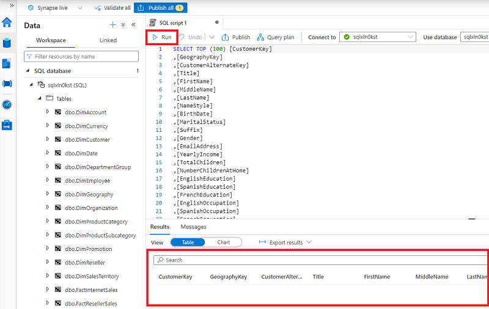

## Build a Transformation Pipeline in Azure

Unlike Azure Data Factory, which requires a separate service to be installed in order to build Orchestration pipelines, Synapse Analytics has pipeline orchestration built in. Let's build a transformation pipeline using Azure Synapse Analytics Pipeline.

1. From Synapse studio, on the **Home** page, select the **Integrate** icon to open the **Integrate Pipeline** tool
2. Select the (+) symbol and select **Pipeline** which loads the familiar Orchestration tool if you've used Azure Data Factory (ADF) before.
3. Under the **Activities** tab, select the **Move & transform** option and then drag **Data flow** onto the canvas.
4. On the far right of the **Activities** tab, turn the ***Dataflow debug*** slider to the right.
5. In the **Turn on data flow debug** tab, select **Ok**.
6. Under the **Settings** tab of the **Data flow**  select the **+ New** to create a new **Dataflow** as shown below:

    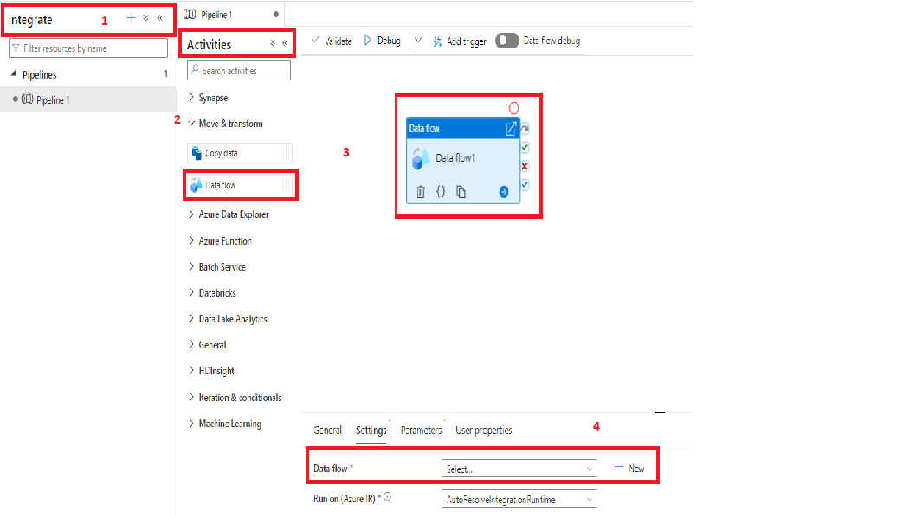

7. In the properties of the ***Dataflow1*** name, it **CustomerTransform**.
8. select the shaded **Add Source** option on the canvas.
9. Selecting the **DataFlow** on the canvas, in the **Source settings** tab, name the **Output stream name** to **CustomersDB**.
10. Further down to the **Dataset**, Select **+ New** to create a new Dataset choosing **Azure Data Lake Storage Gen2** 
11. select **continue**

     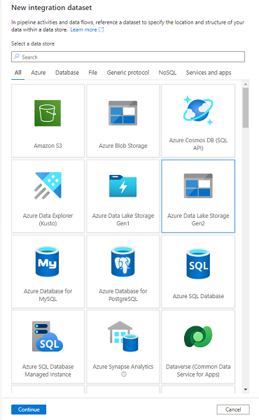

12. Select **DelimitedText**.

    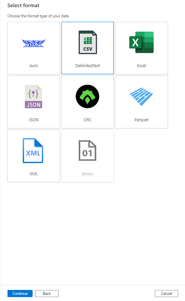

13. Select **Continue**
14. Name your dataset **CustomersText**. In the **Linked service** drop-down, choose your **Synapsexxxxxx-WorspaceDefaultStorage** instance. 
15. In the **File Path** browse to ***Files***, ***data***, and select ***dimCustomer.csv***
16. Ensure the checkbox ***First Row as Header*** is selected.
17. Select **OK** on the **Set Properties** tab
18. In the Dataset line named **CustomersText** on the **Source settings** panel, select ***Open***. Your screen should look similar to below:

    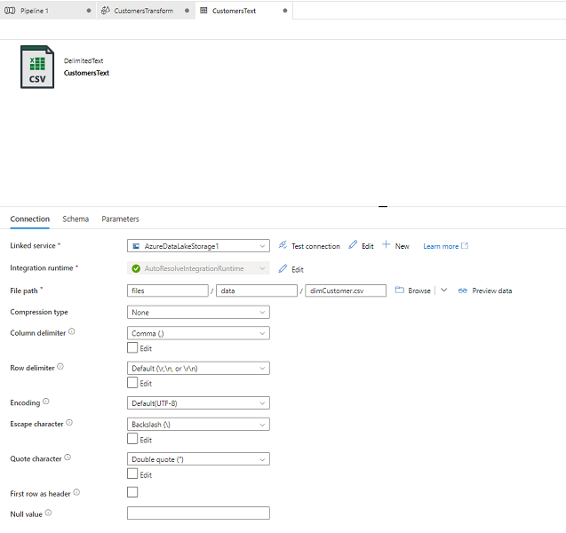

19. If not selected above, select **First row as header** and then select **preview data** in the line of the **File path**. your results should look similar to below:

    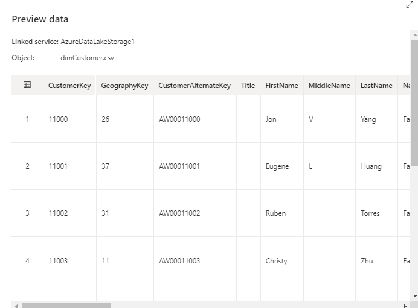

20. Close the preview window and return to the **CustomerTransform** tab, if, you didn't do so earlier, move the ***Data flow debug*** switch to on and then select **OK** accepting the default values in the **Turn on data flow debug**.
21. On the **CustomersDB** select **Projection** and then select the **Import projection** to populate the schema if it's not already populated.

    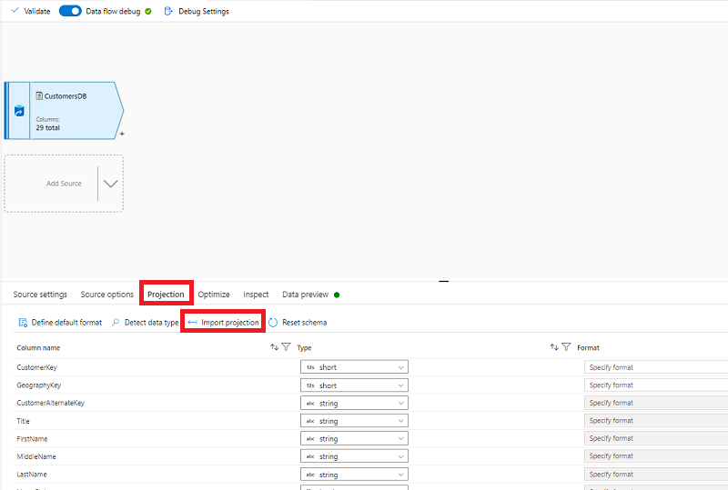

23. Select the **+** on the bottom right-hand side of the ***CustomersDB*** **Data source** and select **Filter**.

    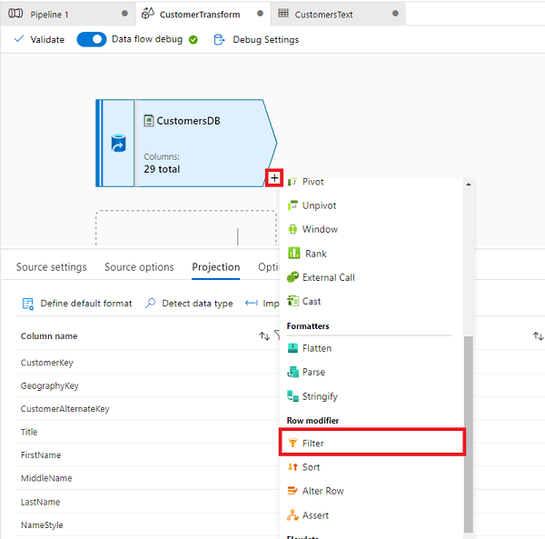

24. In the Filter settings, **select Filter on** and select on the text ***Enter filter...***, select ***Open expression builder***
25. In the **Output Stream name** enter ***OldestCustomers***, next in the filter on type the following code:

```powershell
toInteger(left(DateFirstPurchase, 4)) <= 2011
```

20. Select the **+** symbol on the bottom-right of the **OldestCustomers** Filter component and select **Aggregate** option on the canvas.

    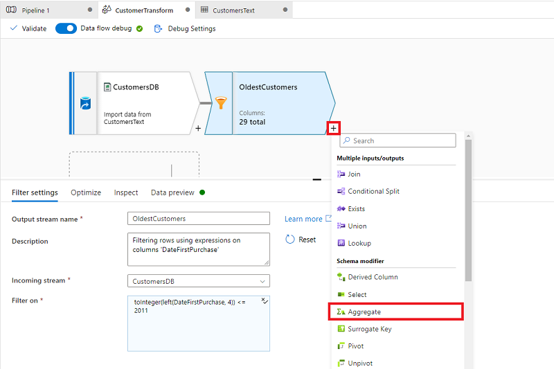

21. In **Output stream name** type ***AggregateOldestCustomers***
22. In the **Group by** tab select GeographyKey and then select the **Aggregates** tab
23. In the **Aggregates tab** under **Column** enter ***TotalCountByRegion*** and in the ***Expression** enter the following expression:

    ```powershell
    count(CustomerKey)
    ```

24. Select on the **Data preview** tab and select **Refresh**.

    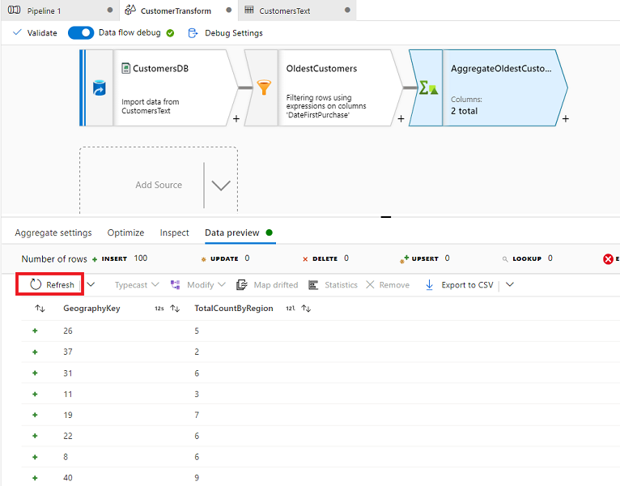

25.  In the same manner as before, select the **+** symbol at the bottom-right of the **AggregateOldestCustomers** aggregate component and select **Sink** option on the canvas.

     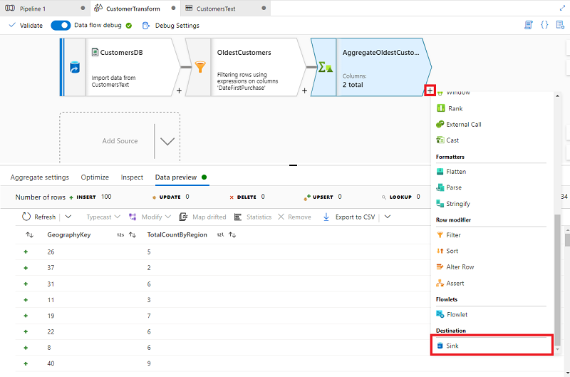

26.  Name the **Output stream name** ***OldestCustomersSink*** and then select **+ New** on the **Dataset** line.
27.  Select **Azure Data Lake Storage Gen2** and then select the **Continue** button.
28.  Select the **DelimitedText** format and select the **Continue** button.
29.  On the **Set properties**, replace ***DelimitedText1*** in the **Name** field with ***CustomerAggregates***.
30.  Select the appropriate **WorkspaceDefaultStorage** created in earlier steps.
31.  In the **File path** row, select the browse button and navigate to ***Files/Data*** then select **Ok**.
32.  Leave the final cell **File name** blank as it will automatically populate the results.
33.  Select the **First row as header** and then press the **OK** button.

 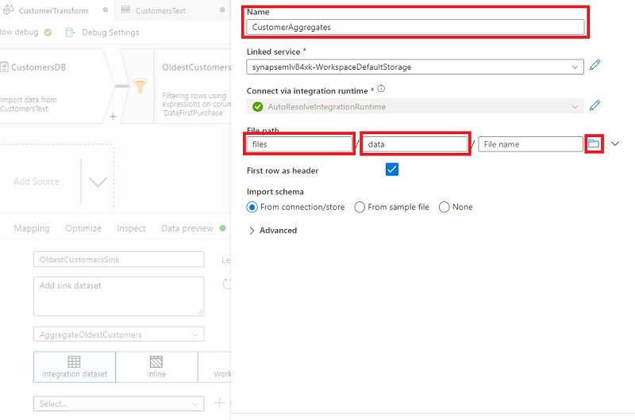

## Debug and monitor the Data Flow

We can debug the pipeline before we publish it. In this step, you're going to trigger a debug run of the data flow pipeline. While data preview doesn't write data, a debug run will write data to your sink destination. This was made possible by selecting the **Data flow debug** option earlier in the exercise.

1. Select the **Pipeline 1** tab on the canvas. Select **Debug** to start a debug run.

 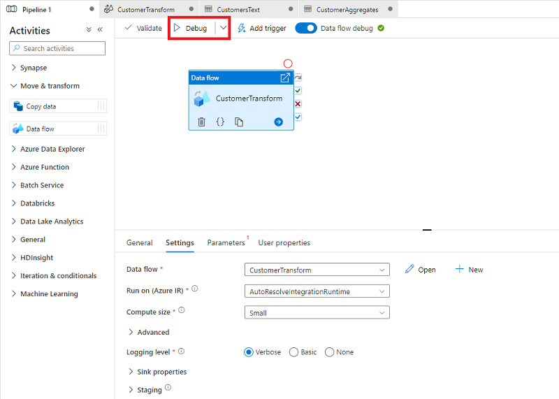

2. Select on the **refresh** icon to view the status of the pipeline in debug mode.

   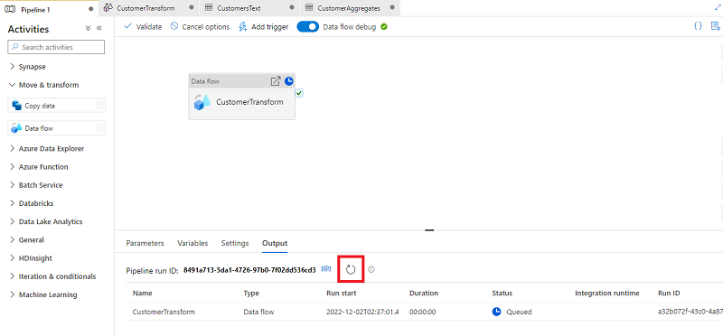

3. Once the package has been debugged, it's time to **Publish** using the **Publish all** button above the **Pipeline 1** tab and development canvas

   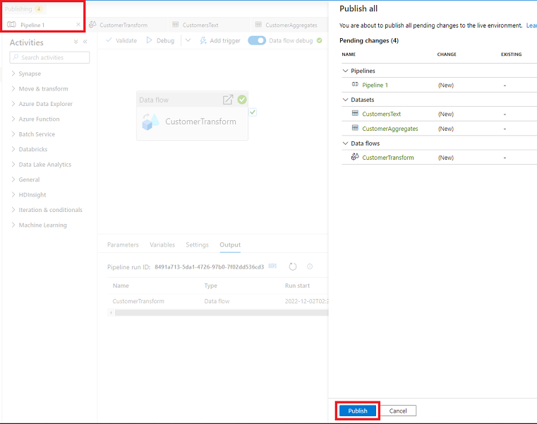
4. Select the **Data** tab in Synapse Studio and then select the **Linked** tab.
5. Expand **Integration Datasets** you'll see the two datasets created during this exercise, ***CustomerAggregates*** and ***CustomersText***.
6. Navigating to the **Develop** tab in Synapse Studio, under the **Data flows** you'll find the ***CustomerTransformation*** data flow package, which we just ran.
7. Navigating to the **Integrate** tab in Synapse Studio, under **Pipelines** you'll find the ***Pipeline 1*** which is the top level of the pipeline we created.
   
## Delete Azure resources

If you've finished exploring Azure Synapse Analytics, you should delete the resources you've created to avoid unnecessary Azure costs.

1. Close the Synapse Studio browser tab and return to the Azure portal.
2. On the Azure portal, on the **Home** page, select **Resource groups**.
3. Select the **dp203-*xxxxxxx*** resource group for your Synapse Analytics workspace (not the managed resource group), and verify that it contains the Synapse workspace, storage account, and Spark pool for your workspace.
4. At the top of the **Overview** page for your resource group, select **Delete resource group**.
5. Enter the **dp203-*xxxxxxx*** resource group name to confirm you want to delete it, and select **Delete**.

    After a few minutes, your Azure Synapse workspace resource group and the managed workspace resource group associated with it will be deleted.
