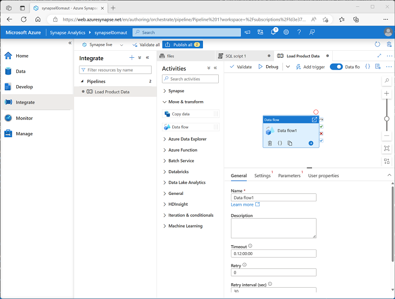
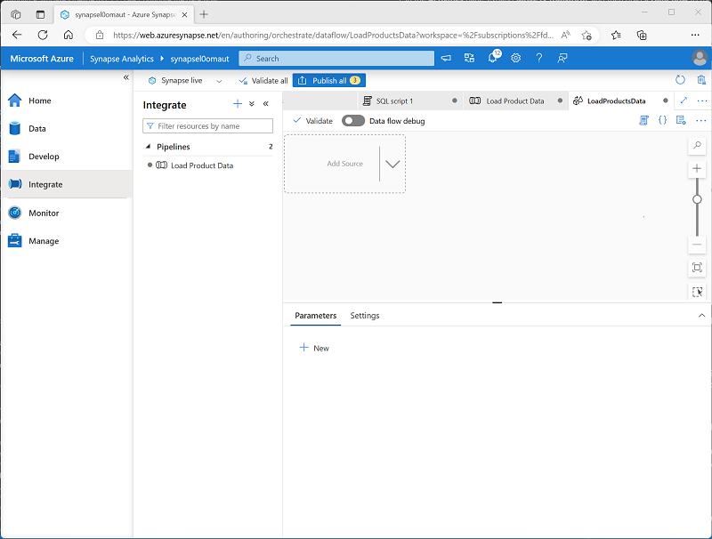
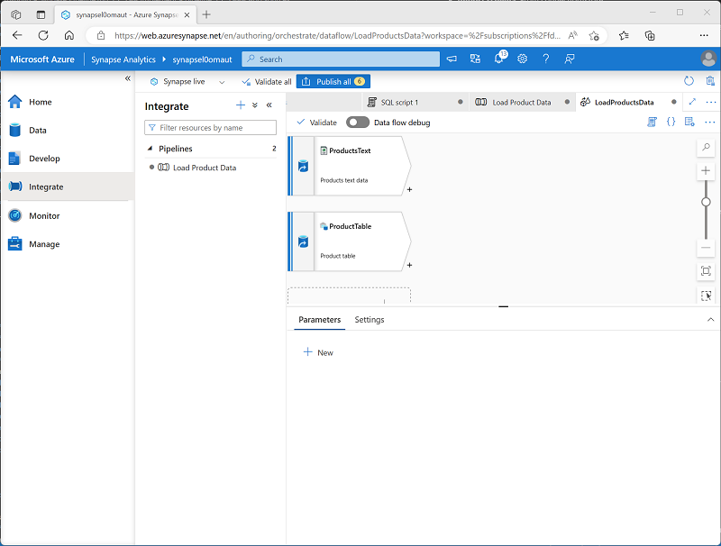
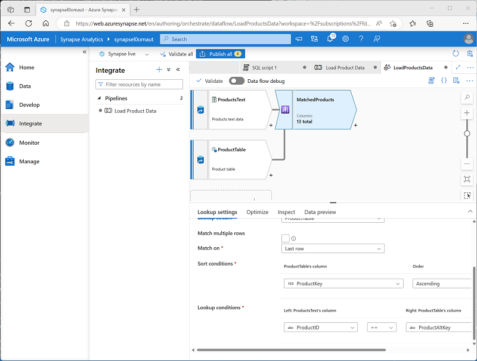
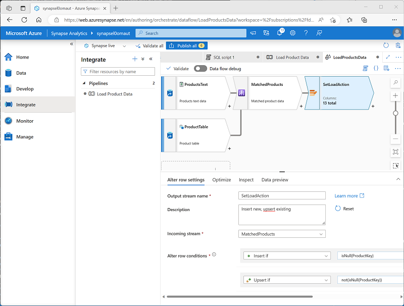
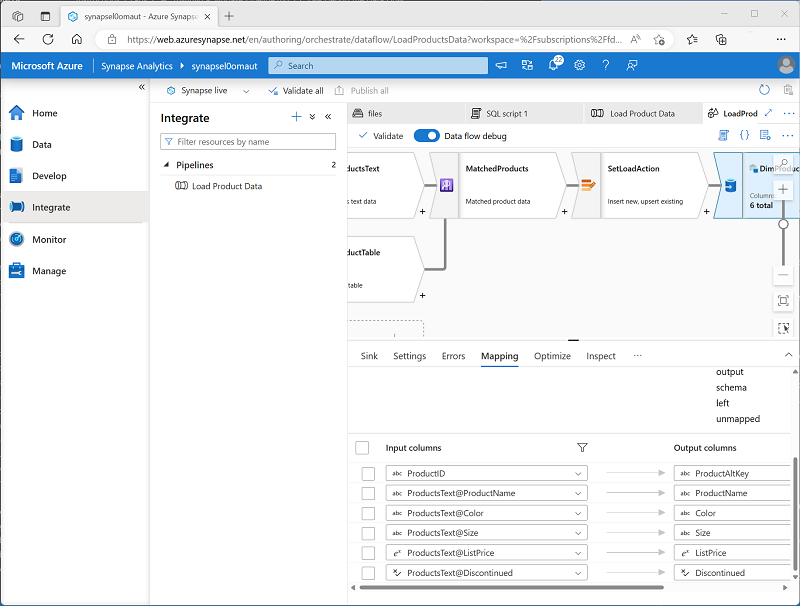

---
lab:
    title: 'Build a data pipeline in Azure Synapse Analytics'
    ilt-use: 'Lab'
---

# Build a data pipeline in Azure Synapse Analytics

In this exercise, you'll load data into a dedicated SQL Pool using a pipeline in Azure Synapse Analytics Explorer. The pipeline will encapsulate a data flow that loads product data into a table in a data warehouse.

This exercise should take approximately **45** minutes to complete.

## Before you start

You'll need an [Azure subscription](https://azure.microsoft.com/free) in which you have administrative-level access.

## Provision an Azure Synapse Analytics workspace

You'll need an Azure Synapse Analytics workspace with access to data lake storage and a dedicated SQL pool hosting a relational data warehouse.

In this exercise, you'll use a combination of a PowerShell script and an ARM template to provision an Azure Synapse Analytics workspace.

1. Sign into the [Azure portal](https://portal.azure.com) at `https://portal.azure.com`.
2. Use the **[\>_]** button to the right of the search bar at the top of the page to create a new Cloud Shell in the Azure portal, selecting a ***PowerShell*** environment and creating storage if prompted. The Cloud Shell provides a command line interface in a pane at the bottom of the Azure portal, as shown here:

    

    > **Note**: If you have previously created a cloud shell that uses a *Bash* environment, use the the drop-down menu at the top left of the cloud shell pane to change it to ***PowerShell***.

3. Note that Cloud Shell can be resized by dragging the separator bar at the top of the pane, or by using the—, **&#9723;**, and **X** icons at the top right of the pane to minimize, maximize, and close the pane. For more information about using the Azure Cloud Shell, see the [Azure Cloud Shell documentation](https://docs.microsoft.com/azure/cloud-shell/overview).

4. In the PowerShell pane, enter the following commands to clone this repository:

    ```powershell
    rm -r dp-203 -f
    git clone https://github.com/MicrosoftLearning/dp-203-azure-data-engineer dp-203
    ```

5. After the repository has been cloned, enter the following commands to change to the folder for this exercise, and run the **setup.ps1** script it contains:

    ```powershell
    cd dp-203/Allfiles/labs/10
    ./setup.ps1
    ```

6. If prompted, choose which subscription you want to use (this will only happen if you have access to multiple Azure subscriptions).
7. When prompted, enter a suitable password to be set for your Azure Synapse SQL pool.

    > **Note**: Be sure to remember this password!

8. Wait for the script to complete - this typically takes around 10 minutes, but in some cases may take longer. While you're waiting, review the [Data flows in Azure Synapse Analytics](https://learn.microsoft.com/azure/synapse-analytics/concepts-data-flow-overview) article in the Azure Synapse Analytics documentation.

## View source and destination data stores

The source data for this exercise is a text file containing product data. The destination is a table in a dedicated SQL pool. Your goal is to create a pipeline that encapsulates a data flow in which the product data in the file is loaded into the table; inserting new products and updating existing ones.

1. After the script has completed, in the Azure portal, go to the **dp203-*xxxxxxx*** resource group that it created, and select your Synapse workspace.
2. In the **Overview** page for your Synapse Workspace, in the **Open Synapse Studio** card, select **Open** to open Synapse Studio in a new browser tab; signing in if prompted.
3. On the left side of Synapse Studio, use the ›› icon to expand the menu - this reveals the different pages within Synapse Studio that you’ll use to manage resources and perform data analytics tasks.
4. On the **Manage** page, on the **SQL pools** tab, select the row for the **sql*xxxxxxx*** dedicated SQL pool and use its **&#9655;** icon to start it; confirming that you want to resume it when prompted.

     Resuming the pool can take a few minutes. You can use the **&#8635; Refresh** button to check its status periodically. The status will show as **Online** when it's ready. While you're waiting, continue with the steps below to view the source data.

5. On the **Data** page, view the **Linked** tab and verify that your workspace includes a link to your Azure Data Lake Storage Gen2 storage account, which should have a name similar to **synapse*xxxxxxx* (Primary - datalake*xxxxxxx*)**.
6. Expand your storage account and verify that it contains a file system container named **files (primary)**.
7. Select the files container, and note that it contains a folder named **data**.
8. Open the **data** folder and observe the **Product.csv** file it contains.
9. Right-click **Product.csv** and select **Preview** to see the data it contains. Note that it contains a header row and some records of product data.
10. Return to the **Manage** page and ensure that your dedicated SQL pool is now online. If not, wait for it.
11. In the **Data** page, on the **Workspace** tab, expand **SQL database**, your **sql*xxxxxxx* (SQL)** database, and its **Tables**.
12. Select the **dbo.DimProduct** table. Then in its **...** menu, select **New SQL script** > **Select TOP 100 rows**; which will run a query that returns the product data from the table - there should be a single row.

## Implement a pipeline

To load the data in the text file into the database table, you will implement an Azure Synapse Analytics pipeline that contains a dataflow encapsulating the logic to ingest the data from the text file, lookup the surrogate **ProductKey** column for products that already exist in the database, and then insert or update rows in the table accordingly.

### Create a pipeline with a data flow activity

1. In Synapse Studio, select the **Integrate** page. Then in the **+** menu select **Pipeline** to create a new pipeline.
2. In the **Properties** pane for your new pipeline, change its name from **Pipeline1** to **Load Product Data**. Then use the **Properties** button above the **Properties** pane to hide it.
3. In the **Activities** pane, expand **Move & transform**; and then drag a **Data flow** to the pipeline design surface as shown here:

    

4. Under the pipeline design surface, in the **General** tab, set the **Name** property to **LoadProducts**.
5. On the **Settings** tab, at the bottom of the list of settings, expand **Staging** and set the following staging settings:
    - **Staging linked service**: Select the **synapse*xxxxxxx*-WorkspaceDefaultStorage** linked service.
    - **Staging storage folder**: Set **container** to **files** and **Directory** to **stage_products**.

### Configure the data flow

1. At the top of the **Settings** tab for the **LoadProducts** data flow, for the **Data flow** property, select **+ New**.
2. In the **Properties** pane for the new data flow design surface that opens, set the **Name** to **LoadProductsData** and then hide the **Properties** pane. The data flow designer should look like this:

    

### Add sources

1. In the data flow design surface, in the **Add Source** drop-down list, select **Add Source**. Then configure the source settings as follows:
    - **Output stream name**: ProductsText
    - **Description**: Products text data
    - **Source type**: Integration dataset
    - **Dataset**: Add a **New** dataset with the following properties:
        - **Type**: Azure Datalake Storage Gen2
        - **Format**: Delimited text
        - **Name**: Products_Csv
        - **Linked service**: synapse*xxxxxxx*-WorkspaceDefaultStorage
        - **File path**: files/data/Product.csv
        - **First row as header**: Selected
        - **Import schema**: From connection/store
    - **Allow schema drift**: Selected
2. On the **Projection** tab for the new **ProductsText** source, set the following data types:
    - **ProductID**: string
    - **ProductName**: string
    - **Color**: string
    - **Size**: string
    - **ListPrice**: decimal
    - **Discontinued**: boolean
3. Add a second source with the following properties:
    - **Output stream name**: ProductTable
    - **Description**: Product table
    - **Source type**: Integration dataset
    - **Dataset**: Add a **New** dataset with the following properties:
        - **Type**: Azure Synapse Analytics
        - **Name**: DimProduct
        - **Linked service**: Create a **New** linked service with the following properties:
            - **Name**: Data_Warehouse
            - **Description**: Dedicated SQL pool
            - **Connect via integration runtime**: AutoResolveIntegrationRuntime
            - **Account selection method** From Azure subscription
            - **Azure subscription**: Select your Azure subscription
            - **Server name**: synapse*xxxxxxx* (Synapse workspace)
            - **Database name**: synapse*xxxxxxx*
            - **SQL pool**: synapse*xxxxxxx*
            **Authentication type**: System Assigned Managed Identity
        - **Table name**: dbo.DimProduct
        - **Import schema**: From connection/store
    - **Allow schema drift**: Selected
4. On the **Projection** tab for the new **ProductTable** source, verify that the following data types are set:
    - **ProductKey**: integer
    - **ProductAltKey**: string
    - **ProductName**: string
    - **Color**: string
    - **Size**: string
    - **ListPrice**: decimal
    - **Discontinued**: boolean
5. Verify that your data flow contains two sources, as shown here:

    

### Add a Lookup

1. Select the **+** icon at the bottom right of the **ProductsText** source and select **Lookup**.
2. Configure the Lookup settings as follows:
    - **Output stream name**: MatchedProducts
    - **Description**: Matched product data
    - **Primary stream**: ProductText
    - **Lookup stream**: ProductTable
    - **Match multiple rows**: <u>Un</u>selected
    - **Match on**: Last row
    - **Sort conditions**: ProductKey ascending
    - **Lookup conditions**: ProductID == ProductAltKey
3. Verify that your data flow looks like this:

    

    The lookup returns a set of columns from *both* sources, essentially forming an outer join that matches the **ProductID** column in the text file to the **ProductAltKey** column in the data warehouse table. When a product with the alternate key already exists in the table, the dataset will include the values from both sources. When the product dos not already exist in the data warehouse, the dataset will contain NULL values for the table columns.

### Add an Alter Row

1. Select the **+** icon at the bottom right of the **MatchedProducts** Lookup and select **Alter Row**.
2. Configure the alter row settings as follows:
    - **Output stream name**: SetLoadAction
    - **Description**: Insert new, upsert existing
    - **Incoming stream**: MatchedProducts
    - **Alter row conditions**: Edit the existing condition and use the **+** button to add a second condition as follows (note that the expressions are *case-sensitive*):
        - InsertIf: `isNull(ProductKey)`
        - UpsertIf: `not(isNull(ProductKey))`
3. verify that the data flow looks like this:

    

    The alter row step configures the kind of load action to perform for each row. Where there's no existing row in the table (the **ProductKey** is NULL), the row from the text file will be inserted. Where there's already a row for the product, an *upsert* will be performed to update the existing row. This configuration essentially applies a *type 1 slowly changing dimension update*.

### Add a sink

1. Select the **+** icon at the bottom right of the **SetLoadAction** alter row step and select **Sink**.
2. Configure the **Sink** properties as follows:
    - **Output stream name**: DimProductTable
    - **Description**: Load DimProduct table
    - **Incoming stream**: SetLoadAction
    - **Sink type**: Integration dataset
    - **Dataset**: DimProduct
    - **Allow schema drift**: Selected
3. On the **Settings** tab for the new **DimProductTable** sink, specify the following settings:
    - **Update method**: Select **Allow insert** and **Allow Upsert**.
    - **Key columns**: Select **List of columns**, and then select the **ProductAltKey** column.
4. On the **Mappings** tab for the new **DimProductTable** sink, clear the **Auto mapping** checkbox and specify <u>only</u> the following column mappings:
    - ProductID: ProductAltKey
    - ProductsText@ProductName: ProductName
    - ProductsText@Color: Color
    - ProductsText@Size: Size
    - ProductsText@ListPrice: ListPrice
    - ProductsText@Discontinued: Discontinued
5. Verify that your data flow looks like this:

    

## Debug the Data Flow

Now that you've built a data flow in a pipeline, you can debug it before publishing.

1. At the top of the data flow designer, enabled **Data flow debug**. Review the default configuration and select **OK**, then wait for the debug cluster to start (which may take a few minutes).
2. In the data flow designer, select the **DimProductTable** sink and view its **Data preview** tab.
3. Use the **&#8635; Refresh** button to refresh the preview, which has the effect of running data through the data flow to debug it.
4. Review the preview data, noting that it indicates one upserted row (for the existing *AR5381* product), indicated by a **<sub>*</sub><sup>+</sup>** icon; and ten inserted rows, indicated by a **+** icon.

## Publish and run the pipeline

Now you're ready to publish and run the pipeline.

1. Use the **Publish all** button to publish the pipeline (and any other unsaved assets).
2. When publishing is complete, close the **LoadProductsData** data flow pane and return to the **Load Product Data** pipeline pane.
3. At the top of the pipeline designer pane, in the **Add trigger** menu, select **Trigger now**. Then select **OK** to confirm you want to run the pipeline.

    **Note**: You can also create a trigger to run the pipeline at a scheduled time or in response to a specific event.

4. When the pipeline has started running, on the **Monitor** page, view the **Pipeline runs** tab and review the status of the **Load Product Data** pipeline.

    The pipeline may take five minutes or longer to complete. You can use the **&#8635; Refresh** button on the toolbar to check its status.

5. When the pipeline run has succeeded, on the **Data** page, use the **...** menu for the **dbo.DimProduct** table in your SQL database to run a query that selects the top 100 rows. The table should contain the data loaded by the pipeline.
   
## Delete Azure resources

If you've finished exploring Azure Synapse Analytics, you should delete the resources you've created to avoid unnecessary Azure costs.

1. Close the Synapse Studio browser tab and return to the Azure portal.
2. On the Azure portal, on the **Home** page, select **Resource groups**.
3. Select the **dp203-*xxxxxxx*** resource group for your Synapse Analytics workspace (not the managed resource group), and verify that it contains the Synapse workspace, storage account, and dedicated SQL pool for your workspace.
4. At the top of the **Overview** page for your resource group, select **Delete resource group**.
5. Enter the **dp203-*xxxxxxx*** resource group name to confirm you want to delete it, and select **Delete**.

    After a few minutes, your Azure Synapse workspace resource group and the managed workspace resource group associated with it will be deleted.
