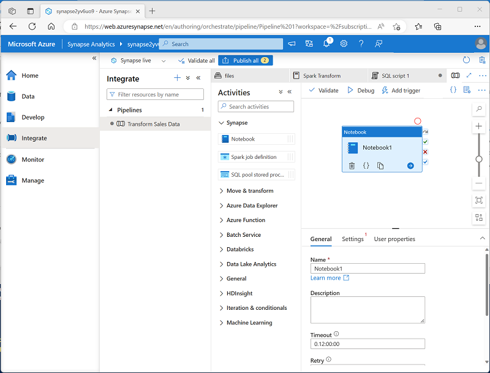
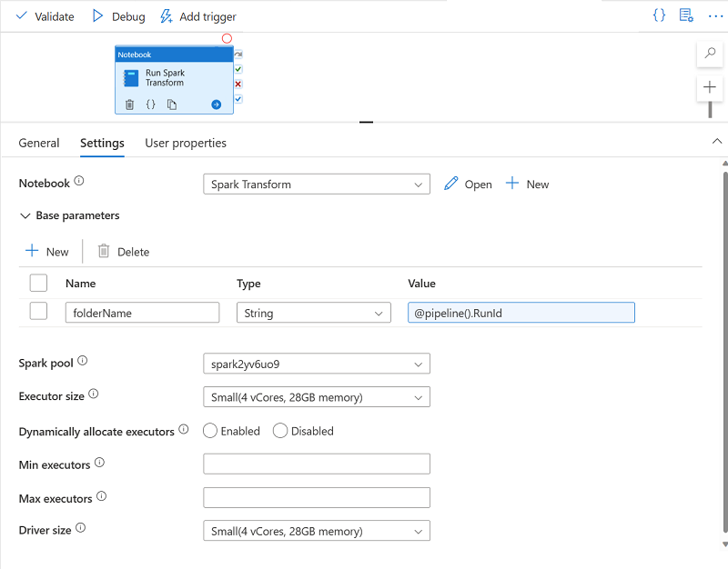

---
lab:
    title: 'Use an Apache Spark notebook in a pipeline'
    ilt-use: 'Lab'
---

# Use an Apache Spark notebook in a pipeline

In this exercise, we're going to create an Azure Synapse Analytics pipeline that includes an activity to run an Apache Spark notebook..

This exercise should take approximately **30** minutes to complete.

## Before you start

You'll need an [Azure subscription](https://azure.microsoft.com/free) in which you have administrative-level access.

## Provision an Azure Synapse Analytics workspace

You'll need an Azure Synapse Analytics workspace with access to data lake storage and a Spark pool.

In this exercise, you'll use a combination of a PowerShell script and an ARM template to provision an Azure Synapse Analytics workspace.

1. Sign into the [Azure portal](https://portal.azure.com) at `https://portal.azure.com`.
2. Use the **[\>_]** button to the right of the search bar at the top of the page to create a new Cloud Shell in the Azure portal, selecting a ***PowerShell*** environment and creating storage if prompted. The Cloud Shell provides a command line interface in a pane at the bottom of the Azure portal, as shown here:

    

    > **Note**: If you have previously created a cloud shell that uses a *Bash* environment, use the the drop-down menu at the top left of the cloud shell pane to change it to ***PowerShell***.

3. Note that Cloud Shell can be resized by dragging the separator bar at the top of the pane, or by using the—, **&#9723;**, and **X** icons at the top right of the pane to minimize, maximize, and close the pane. For more information about using the Azure Cloud Shell, see the [Azure Cloud Shell documentation](https://docs.microsoft.com/azure/cloud-shell/overview).

4. In the PowerShell pane, enter the following commands to clone this repository:

    ```powershell
    rm -r dp-203 -f
    git clone https://github.com/MicrosoftLearning/dp-203-azure-data-engineer dp-203
    ```

5. After the repository has been cloned, enter the following commands to change to the folder for this exercise, and run the **setup.ps1** script it contains:

    ```powershell
    cd dp-203/Allfiles/labs/11
    ./setup.ps1
    ```
    
6. If prompted, choose which subscription you want to use (this will only happen if you have access to multiple Azure subscriptions).
7. When prompted, enter a suitable password to be set for your Azure Synapse SQL pool.

    > **Note**: Be sure to remember this password!

8. Wait for the script to complete - this typically takes around 10 minutes, but in some cases may take longer. While you're waiting, review the [Azure Synapse Pipelines](https://learn.microsoft.com/en-us/azure/data-factory/concepts-data-flow-performance-pipelines) article in the Azure Synapse Analytics documentation.

## Run a Spark notebook interactively

Before automating a data transformation process with a notebook, it can be useful to run the notebook interactively in order to better understand the process you will later automate.

1. After the script has completed, in the Azure portal, go to the dp203-xxxxxxx resource group that it created, and select your Synapse workspace.
2. In the **Overview** page for your Synapse Workspace, in the **Open Synapse Studio** card, select **Open** to open Synapse Studio in a new browser tab; signing in if prompted.
3. On the left side of Synapse Studio, use the ›› icon to expand the menu - this reveals the different pages within Synapse Studio.
4. On the **Data** page, view the Linked tab and verify that your workspace includes a link to your Azure Data Lake Storage Gen2 storage account, which should have a name similar to **synapsexxxxxxx (Primary - datalakexxxxxxx)**.
5. Expand your storage account and verify that it contains a file system container named **files (primary)**.
6. Select the files container, and note that it contains a folder named **data**, which contains the data files you're going to transform.
7. Open the **data**** folder and view the CSV files it contains. Right-click any of the files and select **Preview** to see a sample of the data. Close the preview when finished.
8. In Synapse Studio, on the **Develop** page, expand **Notebooks** and open the **Spark Transform** notebook.
9. Review the code the notebook contains, noting that it:
    - Sets a variable to define a unique folder name.
    - Loads the CSV sales order data from the **/data** folder.
    - Transforms the data by splitting the customer name into multiple fields.
    - Saves the transformed data in Parquet format in the uniquely named folder.
10. In the notebook toolbar, attach the notebook to your **spark*xxxxxxx*** Spark pool and then use the **&#9655; Run All** button to run all of the code cells in the notebook.

    The Spark session may take a few minutes to start before the code cells can run.

11. After all of the notebook cells have run, note the name of the folder in which the transformed data has been saved.
12. Switch to the **files** tab (which should still be open) and view the root **files** folder. If necessary, in then **More** menu, select **Refresh** to see the new folder. Then open it to verify that it contains Parquet files.
13. Return to the root **files** folder, then select the uniquely named folder generated by the notebook and in the **New SQL Script** menu, select **Select TOP 100 rows**.
14. In the **Select TOP 100 rows** pane, set the file type to **Parquet format** and apply the change.
15. In the new SQL Script pane that opens, use the **&#9655; Run** button to run the SQL code and verify that it returns the transformed sales order data.

## Run the notebook in a pipeline

Now that you understand the transformation process, you're ready to automate it by encapsulating the notebook in a pipeline.

### Create a parameters cell

1. In Synapse Studio, return to the **Spark Transform** tab that contains the notebook, and in the toolbar, in the **...** menu at the right end, select **Clear output**.
2. Select the first code cell (which contains the code to set the **folderName** variable).
3. In the pop-up toolbar at the top right of the code cell, in the **...** menu, select **\[@] Toggle parameter cell**. Verify that the word **parameters** appears at the bottom right of the cell.
4. In the toolbar, use the **Publish** button to save the changes.

### Create a pipeline

1. In Synapse Studio, select the **Integrate** page. Then in the **+** menu select **Pipeline** to create a new pipeline.
2. In the **Properties** pane for your new pipeline, change its name from **Pipeline1** to **Transform Sales Data**. Then use the **Properties** button above the **Properties** pane to hide it.
3. In the **Activities** pane, expand **Synapse**; and then drag a **Notebook** activity to the pipeline design surface as shown here:

    

4. In the **General** tab for the Notebook activity, change its name to **Run Spark Transform**.
5. In the **Settings** tab for the Notebook activity, set the following properties:
    - **Notebook**: Select the **Spark Transform** notebook.
    - **Base parameters**: Expand this section and define a parameter with the following settings:
        - **Name**: folderName
        - **Type**: String
        - **Value**: Select **Add dynamic content** and set the parameter value to the *Pipeline Run ID* system variable (`@pipeline().RunId`)
    - **Spark pool**: Select the **spark*xxxxxxx*** pool.
    - **Executor size**: Select **Small (4 vCores, 28GB Memory)**.

    Your pipeline pane should look similar to this:

    

### Publish and run the pipeline

1. Use the **Publish all** button to publish the pipeline (and any other unsaved assets).
2. At the top of the pipeline designer pane, in the **Add trigger** menu, select **Trigger now**. Then select **OK** to confirm you want to run the pipeline.

    **Note**: You can also create a trigger to run the pipeline at a scheduled time or in response to a specific event.

3. When the pipeline has started running, on the **Monitor** page, view the **Pipeline runs** tab and review the status of the **Transform Sales Data** pipeline.
4. Select the **Transform Sales Data** pipeline to view its details, and note the Pipeline run ID in the **Activity runs** pane.

    The pipeline may take five minutes or longer to complete. You can use the **&#8635; Refresh** button on the toolbar to check its status.

5. When the pipeline run has succeeded, on the **Data** page, browse to the **files** storage container and verify that a new folder named for the pipeline run ID has been created, and that it contains Parquet files for the transformed sales data.
   
## Delete Azure resources

If you've finished exploring Azure Synapse Analytics, you should delete the resources you've created to avoid unnecessary Azure costs.

1. Close the Synapse Studio browser tab and return to the Azure portal.
2. On the Azure portal, on the **Home** page, select **Resource groups**.
3. Select the **dp203-*xxxxxxx*** resource group for your Synapse Analytics workspace (not the managed resource group), and verify that it contains the Synapse workspace, storage account, and Spark pool for your workspace.
4. At the top of the **Overview** page for your resource group, select **Delete resource group**.
5. Enter the **dp203-*xxxxxxx*** resource group name to confirm you want to delete it, and select **Delete**.

    After a few minutes, your Azure Synapse workspace resource group and the managed workspace resource group associated with it will be deleted.
