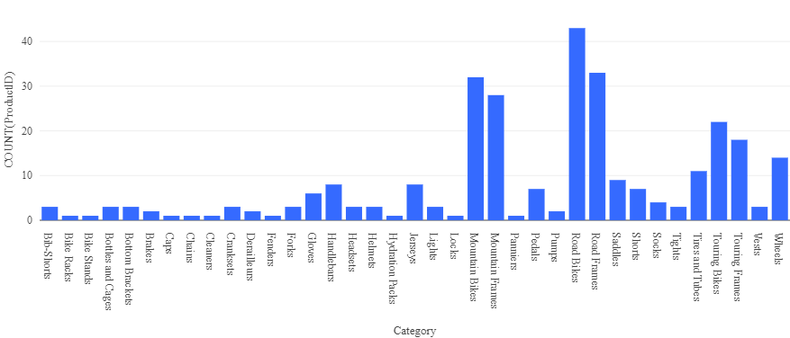

---
lab:
    title: 'Explore Azure Databricks'
    ilt-use: 'Suggested demo'
---

# Explore Azure Databricks

Azure Databricks is a Microsoft Azure-based version of the popular open-source Databricks platform.

Similarly to Azure Synapse Analytics, an Azure Databricks *workspace* provides a central point for managing Databricks clusters, data, and resources on Azure.

This exercise should take approximately **30** minutes to complete.

## Before you start

You'll need an [Azure subscription](https://azure.microsoft.com/free) in which you have administrative-level access.

## Provision an Azure Databricks workspace

In this exercise, you'll use a script to provision a new Azure Databricks workspace.

> **Tip**: If you already have a *Standard* or *Trial* Azure Databricks workspace, you can skip this procedure and use your existing workspace.

1. In a web browser, sign into the [Azure portal](https://portal.azure.com) at `https://portal.azure.com`.
2. Use the **[\>_]** button to the right of the search bar at the top of the page to create a new Cloud Shell in the Azure portal, selecting a ***PowerShell*** environment and creating storage if prompted. The cloud shell provides a command line interface in a pane at the bottom of the Azure portal, as shown here:

    

    > **Note**: If you have previously created a cloud shell that uses a *Bash* environment, use the the drop-down menu at the top left of the cloud shell pane to change it to ***PowerShell***.

3. Note that you can resize the cloud shell by dragging the separator bar at the top of the pane, or by using the **&#8212;**, **&#9723;**, and **X** icons at the top right of the pane to minimize, maximize, and close the pane. For more information about using the Azure Cloud Shell, see the [Azure Cloud Shell documentation](https://docs.microsoft.com/azure/cloud-shell/overview).

4. In the PowerShell pane, enter the following commands to clone this repo:

    ```
    rm -r dp-203 -f
    git clone https://github.com/MicrosoftLearning/dp-203-azure-data-engineer dp-203
    ```

5. After the repo has been cloned, enter the following commands to change to the folder for this lab and run the **setup.ps1** script it contains:

    ```
    cd dp-203/Allfiles/labs/23
    ./setup.ps1
    ```

6. If prompted, choose which subscription you want to use (this will only happen if you have access to multiple Azure subscriptions).

7. Wait for the script to complete - this typically takes around 5 minutes, but in some cases may take longer. While you are waiting, review the [What is Azure Databricks?](https://learn.microsoft.com/azure/databricks/introduction/) article in the Azure Databricks documentation.

## Create a cluster

Azure Databricks is a distributed processing platform that uses Apache Spark *clusters* to process data in parallel on multiple nodes. Each cluster consists of a driver node to coordinate the work, and worker nodes to perform processing tasks.

In this exercise, you'll create a *single-node* cluster to minimize the compute resources used in the lab environment (in which resources may be constrained). In a production environment, you'd typically create a cluster with multiple worker nodes.

> **Tip**: If you already have a cluster with a 13.3 LTS runtime version in your Azure Databricks workspace, you can use it to complete this exercise and skip this procedure.

1. In the Azure portal, browse to the **dp203-*xxxxxxx*** resource group that was created by the script (or the resource group containing your existing Azure Databricks workspace)
1. Select your Azure Databricks Service resource (named **databricks*xxxxxxx*** if you used the setup script to create it).
1. In the **Overview** page for your workspace, use the **Launch Workspace** button to open your Azure Databricks workspace in a new browser tab; signing in if prompted.

    > **Tip**: As you use the Databricks Workspace portal, various tips and notifications may be displayed. Dismiss these and follow the instructions provided to complete the tasks in this exercise.

1. View the Azure Databricks workspace portal and note that the sidebar on the left side contains links for the various types of task you can perform.

1. Select the **(+) New** link in the sidebar, and then select **Cluster**.
1. In the **New Cluster** page, create a new cluster with the following settings:
    - **Cluster name**: *User Name's* cluster (the default cluster name)
    - **Cluster mode**: Single Node
    - **Access mode**: Single user (*with your user account selected*)
    - **Databricks runtime version**: 13.3 LTS (Spark 3.4.1, Scala 2.12)
    - **Use Photon Acceleration**: Selected
    - **Node type**: Standard_DS3_v2
    - **Terminate after** *30* **minutes of inactivity**

1. Wait for the cluster to be created. It may take a minute or two.

> **Note**: If your cluster fails to start, your subscription may have insufficient quota in the region where your Azure Databricks workspace is provisioned. See [CPU core limit prevents cluster creation](https://docs.microsoft.com/azure/databricks/kb/clusters/azure-core-limit) for details. If this happens, you can try deleting your workspace and creating a new one in a different region. You can specify a region as a parameter for the setup script like this: `./setup.ps1 eastus`

## Use Spark to analyze a data file

As in many Spark environments, Databricks supports the use of notebooks to combine notes and interactive code cells that you can use to explore data.

1. In the sidebar, use the **(+) New** link to create a **Notebook**.
1. Change the default notebook name (**Untitled Notebook *[date]***) to **Explore products** and in the **Connect** drop-down list, select your cluster if it is not already selected. If the cluster is not running, it may take a minute or so to start.
1. Download the [**products.csv**](https://raw.githubusercontent.com/MicrosoftLearning/dp-203-azure-data-engineer/master/Allfiles/labs/23/adventureworks/products.csv) file to your local computer, saving it as **products.csv**. Then, in the **Explore products** notebook, on the **File** menu, select **Upload data to DBFS**.
1. In the **Upload Data** dialog box, note the **DBFS Target Directory** to where the file will be uploaded. Then select the **Files** area, and upload the **products.csv** file you downloaded to your computer. When the file has been uploaded, select **Next**
1. In the **Access files from notebooks** pane, select the sample PySpark code and copy it to the clipboard. You will use it to load the data from the file into a DataFrame. Then select **Done**.
1. In the **Explore products** notebook, in the empty code cell, paste the code you copied; which should look similar to this:

    ```python
    df1 = spark.read.format("csv").option("header", "true").load("dbfs:/FileStore/shared_uploads/user@outlook.com/products.csv")
    ```

1. Use the **&#9656; Run Cell** menu option at the top-right of the cell to run it, starting and attaching the cluster if prompted.
1. Wait for the Spark job run by the code to complete. The code has created a *dataframe* object named **df1** from the data in the file you uploaded.
1. Under the existing code cell, use the **+** icon to add a new code cell. Then in the new cell, enter the following code:

    ```python
    display(df1)
    ```

1. Use the **&#9656; Run Cell** menu option at the top-right of the new cell to run it. This code displays the contents of the dataframe, which should look similar to this:

    | ProductID | ProductName | Category | ListPrice |
    | -- | -- | -- | -- |
    | 771 | Mountain-100 Silver, 38 | Mountain Bikes | 3399.9900 |
    | 772 | Mountain-100 Silver, 42 | Mountain Bikes | 3399.9900 |
    | ... | ... | ... | ... |

1. Above the table of results, select **+** and then select **Visualization** to view the visualization editor, and then apply the following options:
    - **Visualization type**: Bar
    - **X Column**: Category
    - **Y Column**: *Add a new column and select* **ProductID**. *Apply the* **Count** *aggregation*.

    Save the visualization and observe that it is displayed in the notebook, like this:

    

## Create and query a table

While many data analysis are comfortable using languages like Python or Scala to work with data in files, a lot of data analytics solutions are built on relational databases; in which data is stored in tables and manipulated using SQL.

1. In the **Explore products** notebook, under the chart output from the previously run code cell, use the **+** icon to add a new cell.
2. Enter and run the following code in the new cell:

    ```python
    df1.write.saveAsTable("products")
    ```

3. When the cell has completed, add a new cell under it with the following code:

    ```sql
    %sql

    SELECT ProductName, ListPrice
    FROM products
    WHERE Category = 'Touring Bikes';
    ```

4. Run the new cell, which contains SQL code to return the name and price of products in the *Touring Bikes* category.
5. In the sidebar, select the **Catalog** link, and verify that the **products** table has been created in the default database schema (which is unsurprisingly named **default**). It's possible to use Spark code to create custom database schemas and a schema of relational tables that data analysts can use to explore data and generate analytical reports.

## Delete Azure Databricks resources

Now you've finished exploring Azure Databricks, you must delete the resources you've created to avoid unnecessary Azure costs and free up capacity in your subscription.

1. Close the Azure Databricks workspace browser tab and return to the Azure portal.
2. On the Azure portal, on the **Home** page, select **Resource groups**.
3. Select the **dp203-*xxxxxxx*** resource group (not the managed resource group), and verify that it contains your Azure Databricks workspace.
4. At the top of the **Overview** page for your resource group, select **Delete resource group**.
5. Enter the **dp203-*xxxxxxx*** resource group name to confirm you want to delete it, and select **Delete**.

    After a few minutes, your resource group and the managed workspace resource groups associated with it will be deleted.
